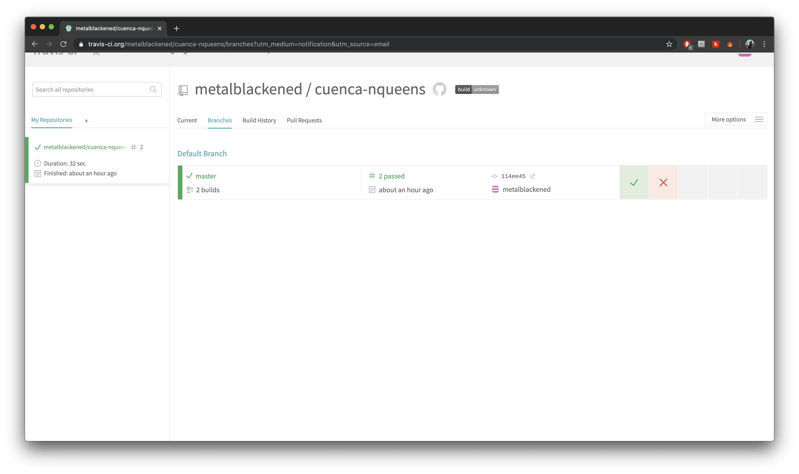
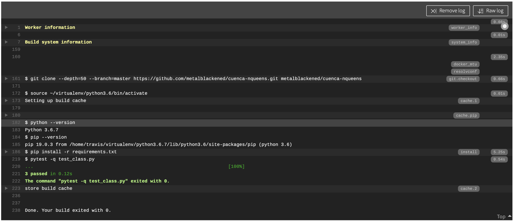
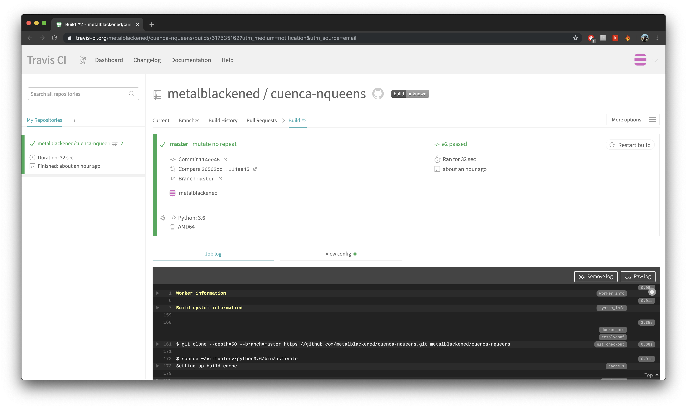

# Problema N-Queen Cuenca
---
Solución del problema N-Queen usando algortimo genetico

* El objetivo es colocar N reinas en un tablero de ajedrez de N x N, de tal manera de que las reinas no se ataquen entre ellas
* Se decidio usar un algoritmo genetico al ser un problema de maximización 

---
## Algoritmo

Se simula una evolución genetica de la siguiente manera:

1. Inicialización de la población.
2. Evaluación de los individuos de la población.
3. Ordenamiento de los mejores.
4. Muerte de la mitad de individuos menos optimos.
5. Cruza
6. Mutación

El proceso se repite del paso 2 hasta el 6 hasta encontar una solución

---
## Función de Aptitud

Caracterizaremos la aptitud como un valor máximo. A pesar de que un menor número de enfrentamientos significa mayor aptitud, para fines de implementación, consideramos los valores máximos de aptitud. Esto se puede hacer porque restamos el número de enfrentamientos a los enfrenttamientos totales posibles

```python
clashes = 0;

row_col_clashes = abs(len(chromosome) - len(np.unique(chromosome)))
clashes += row_col_clashes

# calculate diagonal clashes
for i in range(len(chromosome)):
    for j in range(len(chromosome)):
        if ( i != j):
            dx = abs(i-j)
            dy = abs(chromosome[i] - chromosome[j])
            if(dx == dy):
                clashes += 1


return total_clashes - clashes
```
---
## Interpretación de resultados


Cada fila de la fila de ajedrez está indexada de 0-> n. La secuencia [a b c d ....] significa que en la columna, y en una fila n, la reina está presente y así sucesivamente. 

```python
    [1 1 1 1 1 1 1 1] #No es una solución posible
    [1 1 1 4 2 1 2 4] #Del mismo modo, tampoco es una solución.
    [2 7 3 4 8 5 1 2] #Esta satisface el problema de 8 reinas y, por lo tanto, una solución.
```

---
## Despliegue

Correr los siguientes comandos
```
docker-compose build
docker-compose up -d db
docker-compose run queen
```
Se mostrara un menu


    1. Encontrar soluciones (dado un input n, se ejecutara el algoritmo y si se encuentra una solución la guardara en la base de datos)
    2. Ver soluciones (Podemos ver las soluciones encontradas y guardas en la base de datos)

---
## Travis 






